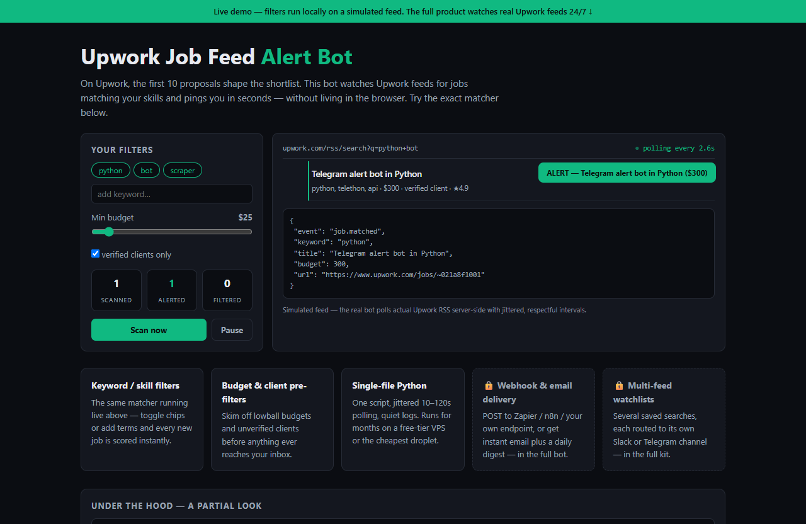

# Upwork Job Feed Alert Bot — live demo

  

  <a href="https://amos-mig.github.io/upwork-job-feed-alert-bot-demo/"><strong>▶ Open the live demo</strong></a> ·
  <a href="https://amosmign.gumroad.com/l/upwork-job-feed-alert-bot"><strong>Get the full product · €29</strong></a>

## What this is

A client-side simulation of the Upwork Job Feed Alert Bot: keyword, budget and client-verification filters run against a live-streaming simulated Upwork feed, firing alert payloads for matches and explaining every skip. The full server-side bot — real RSS polling, webhook/email delivery and multi-feed watchlists — stays locked behind feature cards and a partial code excerpt.

**Try it:** Toggle the keyword chips or raise the minimum budget and watch incoming feed items flip between ALERT and SKIPPED with reasons, while matched jobs pop a toast and reveal their delivery payload.

## What you get in the full product

- Instant alerts for jobs matching keyword/skill filters
- Budget and client-history pre-filters to avoid junk gigs
- Webhook or email delivery, your choice
- Runs continuously on the cheapest VPS or free tier
- Single Python file with respectful polling intervals

## About

- **Storefront:** [kits.amosmignery.dev](https://kits.amosmignery.dev) — single-file products, instant download, commercial license
- **Checkout:** [Gumroad](https://amosmign.gumroad.com/l/upwork-job-feed-alert-bot) (Merchant of Record, VAT handled)
- **Full product:** [Upwork Job Feed Alert Bot](https://amosmign.gumroad.com/l/upwork-job-feed-alert-bot) · €29

## License

The demo page in this repo is MIT-licensed — reuse the technique, not the product.
The **Upwork Job Feed Alert Bot** itself is not included here and is not free software.
